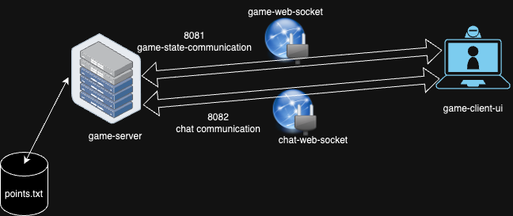

# Husky Town!


## Architechture
Here is a simplified architechture diagram for our husky-town project.


## Getting started

### Game-Server
- start game-server using ```dub``` inside ```game-server``` project
- Type ```quit``` in game-server's stdin to exit the server gracefully and persist the state.

### Game-Client
- start the client using ```dub``` inside the ```game-client-ui``` project
- you can communicate with the server through chat now.

### Sharing Feature
The basic idea of our sharing feature is to increase user retention on the platform by rewarding them with loyalty points for the amount of time they spend on each session inside the game, which they can use for micro-transaction within the game eco system.
Currently supported features on client :
- If you type ```getMyPoints``` in chat , server sends you the amount of points you have.
- If you type ```send:100:playerId``` in chat , if you have 100 points and playerId exists in the game store, it makes the transaction and brodcasts the sucessful transaction to all players on server. If transaction fails the user making it gets feedback in terminal.
- On quitting client, you get the amount of points earned in that session, that get added up to your total.
- On Quitting the points you made will be brodcasted to other clients on server telling them that you left and made x amount of points.

## Video Demo
Here is a welcome video showing the repoisory organization--be sure to read carefully through the instructions (Consuming a large spec and breaking it down is part of engineering!).

<a href="https://www.youtube.com/watch?v=paOKmCxV8wg">

</a>

https://www.youtube.com/watch?v=paOKmCxV8wg


